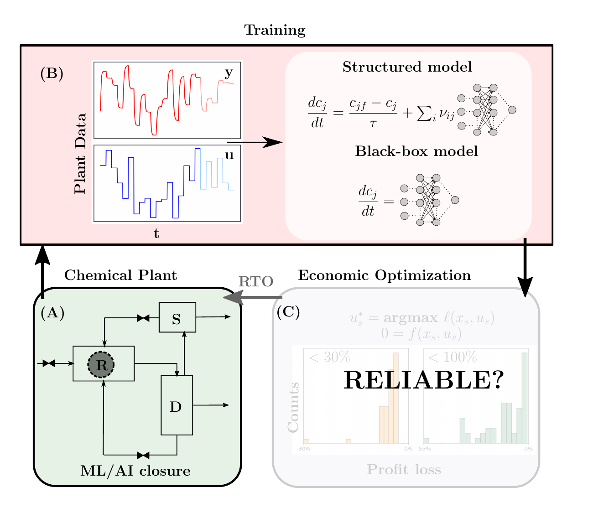

<div align="center">

<h1>A Tale of Perfect Fit and Phantom Optima</h1>

<h3><em>How data-driven models can fail in real-time optimization</em></h3>

**Prithvi Dake**<sup>1,\*</sup> &nbsp;&nbsp; **Rahul Bindlish**<sup>2</sup> &nbsp;&nbsp; **James B. Rawlings**<sup>1</sup>

<sup>1</sup>Department of Chemical Engineering, University of California, Santa Barbara, CA 93106, USA<br>
<sup>2</sup>Dow Chemical Company, TX, USA

<sup>\*</sup>Corresponding author: [prithvidake@ucsb.edu](mailto:prithvidake@ucsb.edu)

[](https://doi.org/10.5281/zenodo.21464341)
[](environment.yml)
[](Makefile)



<sub>Project page: <https://dakeprithvi.github.io/2026c_structure_id_plant></sub>

</div>

---

## 📦 Data availability

The large result pickles are **not** stored in git. They are
archived on Zenodo:

> Dake, P., Bindlish, R., & Rawlings, J. (2026). *Dataset for 'A tale of perfect
> fit and phantom optima: how data-driven models can fail in real-time
> optimization'* (v1.0) [Data set]. Zenodo.
> <https://doi.org/10.5281/zenodo.21464341>

These caches let you reproduce the figures without re-running the (multi-hour)
training. They are **not** required to run the pipeline from scratch.

---

## 🚀 Reproducing the results

### 1. Environment

```bash
conda env create -f environment.yml
conda activate base
```

### 2. Build everything (paper + figures)

```bash
make
```

> [!NOTE]
> By default the build uses the cached pickles (`USE_PICKLE_BACKUPS := True` in
> the `Makefile`). To regenerate results from scratch instead, set it to `False`
> in a local `Makefile.options` — **the NN training stages take several hours.**

### 3. Fetching the data caches

Download the pickles from the Zenodo record above into the repository root (or
use the cached backups under `backups/`) before running with
`USE_PICKLE_BACKUPS := True`.

---

## 📝 Citation

If you use this code, please cite both the paper (full reference to be added upon
acceptance) and the Zenodo archive:

```bibtex
@dataset{dake_2026_phantom_optima,
  author    = {Dake, Prithvi and Bindlish, Rahul and Rawlings, James B.},
  title     = {Dataset for 'A tale of perfect fit and phantom optima:
               how data-driven models can fail in real-time optimization'},
  year      = {2026},
  version   = {v1.0},
  publisher = {Zenodo},
  doi       = {10.5281/zenodo.21464341},
  url       = {https://doi.org/10.5281/zenodo.21464341}
}
```
